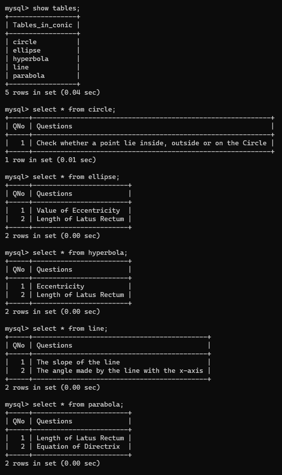

### MySQL Tables

Just including the screenshot of the MySQL of the tables required in the Project. 
These Tables contain the questions that get displayed when the program has displayed the graph of requested Conic Section.

**NOTE:** These tables are present in the datbase named as *Conic* made on MySQL.

